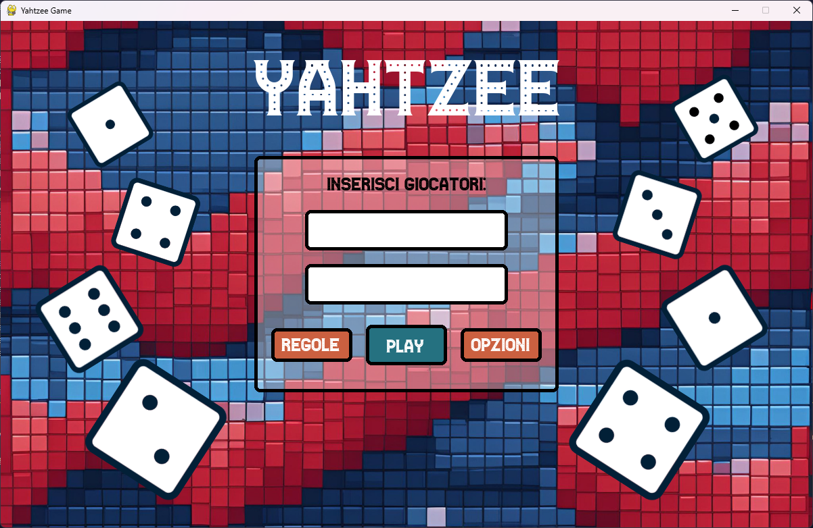
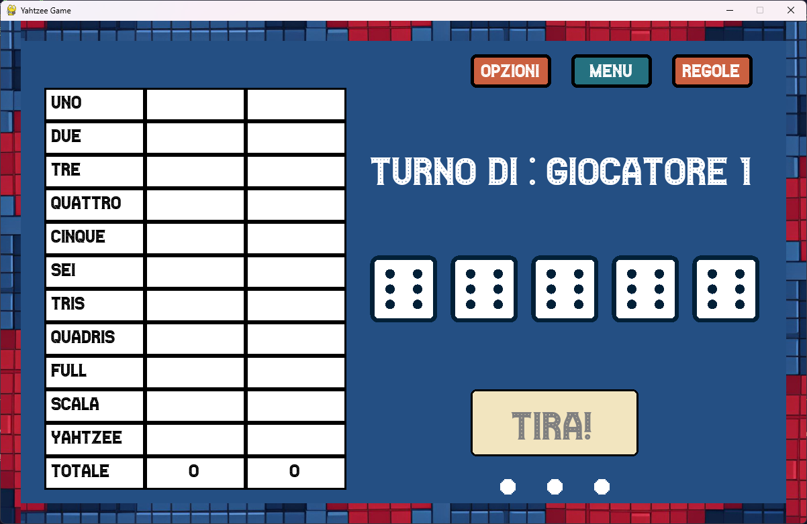
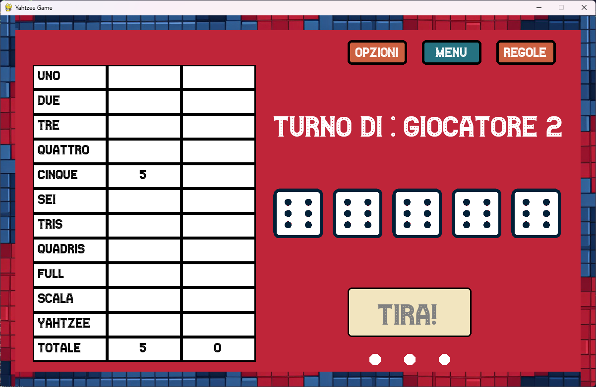

<!--  -->

<a href="https://visitcount.itsvg.in">
  
</a>

<h1 align="center">
    
</h1>

## Description 📝

This is a digital version of the popular dice game Yahtzee, implemented using the Pygame library. It is designed for 2 players and includes features such as:

- **Dice rolls** with selection of results to keep.
- **Automated scoring system** with classic rules.
- **Customised graphical user interface**.
- **Background music** and **sound effects**.

---

## Screenshot 📸

</br>


</br>

---

## Main features ✨

1. **Local Multiplayer**: Supports two players.
2. **Integrated game rules**: Shows both basic and complex combinations.
3. **Customised graphics**: Use images and fonts to create an immersive atmosphere.
4. **Immersive Audio**: Includes sound effects for rolls, dice selection and winnings.
5. **Customisable options**: Control music and sound effects.

---

## How to Start🚀

### Prerequisites
- **Python 3.x**
- **Pygame library**: Install it with the command:

  ```bash
  pip install pygame
  ```

### Starting the game
1. Clone the repository:
   ```bash
   git clone <https://github.com/G4tten/Yahtzee-on-Python>
   cd <folder name>
   ```
2. Run the main file:
   ```bash
   python Yahtzee.py
   ```

---

## Game Rules 🃏

### Basic Combinations
- **One**: Sum of dice showing 1.
- **Two**: Sum of dice showing 2.
- **Three**: Sum of dice showing 3.
- **Four**: Sum of the dice showing 4.
- **Five**: Sum of the dice showing 5.
- **Six**: Sum of the dice showing 6.

### Complex Combinations
- **Trips**: Three equal dice (sum of all dice).
- **Quadris**: Four equal dice (sum of all dice).
- **Full**: A combination of 3 and 2 equal dice (25 points).
- **Scale**: All different dice (40 points).
- **Yahtzee**: All equal dice (50 points).

---

## Authors 👩‍💻👨‍💻

- [Ludovica Gatti (@G4tten)](https://github.com/G4tten)
- [Luigi Gorgone (@luishasleft)](https://github.com/luishasleft)

---
<!--
## Future improvements 🛠️

1. Implementation of a score saving system.
2. Support for multiple players.
3. Full screen mode.

---
-->

## Credits and Resources 🎨

- **Font**: Casino.ttf [<a href="https://www.dafont.com/casino-2.font">Site links]
- **Sound Effects**: Sounds by <a href="https://pixabay.com/">Pixabay</a>.
- **Dice Graphics**: images taken from <a href="https://it.vecteezy.com/vettori-gratis/nero">Nero Vettori di Vecteezy</a> [<a href="https://it.vecteezy.com/arte-vettoriale/6923039-linea-gioco-di-dadi-set-icona-set-di-dadi-puntati-lancio-da-uno-a-sei-dadi-per-casino-craps-tavolo-o-giochi-da-tavola-fortuna-e-scelta-casuale-vettore-illustrazione-isolato">Site links</a>]
- **Background Images**: Created with AI

---
<!--
## Licence 📄
*(Specificare una licenza, ad esempio MIT, o lasciare libera se non necessario.)*
-->
